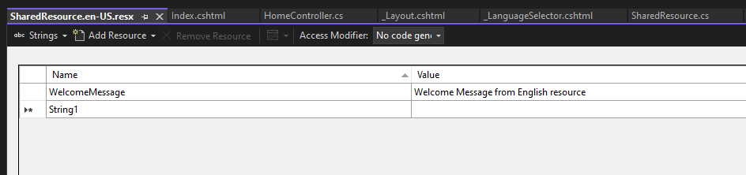

# .Net 6 Localization With Button

A demo app built in .Net 6 that uses AspNetCore.Localization and allows a user to switch languages via a button click.


## Documentation

Built using Visual Studio 2022

Below are the steps I made to a new ASP.NET Core Web App (Model-View-Controller) .Net 6.0 project to accomplish this.


### Program.cs
Right after => ``` var builder = WebApplication.CreateBuilder(args); ```

```
builder.Services.AddControllersWithViews()
    .AddViewLocalization(LanguageViewLocationExpanderFormat.Suffix);

builder.Services.AddLocalization();

var localizationOptions = new RequestLocalizationOptions();
var supportedCultures = new[]
    {
        new CultureInfo("en-US"),
        new CultureInfo("es-ES"),
        // Add more supported cultures as needed.
    };

localizationOptions.SetDefaultCulture("en-US");
localizationOptions.SupportedCultures= supportedCultures;
localizationOptions.SupportedUICultures= supportedCultures;
localizationOptions.ApplyCurrentCultureToResponseHeaders = true;

```

Then after  => ``` var app = builder.Build();```

```
app.UseRequestLocalization(localizationOptions);
```

### Add a Folder at the ROOT of the project
I added a folder titled "Resources" at the root of the project


### Add New Class
Within the new Resources folder, I added a Class "SharedResource.cs" that contains one property
```
    public class SharedResource
    {
        public string WelcomeMessage { get; set; }
    }
```

### Add Resource Files
The naming convention is CRITICAL and needs to be the name of the class followed by a dot then the language.\
I added the below resource files in the same "Resources" folder.
```
SharedResource.en-US.resx
SharedResource.es-ES.resx
```
Within each resource file, I added a key of "WelcomeMessage" with a value.




After all of that, you should have a folder titled "Resources" with the included files like this.


### Home Controller

Now within my HomeController I injected the IStringLocalizer<SharedResources> for use.
```
    public class HomeController : Controller
    {
        private readonly ILogger<HomeController> _logger;
        private readonly IStringLocalizer<SharedResource> _stringLocalizer; // <---- ADDED THIS

        //  ALSO UPDATED THE CONSTRUCTOR TO INCLUDE THE IStringLocalizer<SharedResource>
        public HomeController(ILogger<HomeController> logger, IStringLocalizer<SharedResource> loc)
        {
            _stringLocalizer = loc;
            _logger = logger;
        }

```

I also added a method to the Home Controller that allowed the button click event to update the language

```
 [HttpPost]
        public IActionResult SetCulture(string culture, string returnUrl)
        {

            if(culture != null) { 
            
                Response.Cookies.Append(
                    CookieRequestCultureProvider.DefaultCookieName,
                    CookieRequestCultureProvider.MakeCookieValue(new RequestCulture(culture)),
                    new CookieOptions { Expires = DateTimeOffset.UtcNow.AddYears(1) }
                );
            }

            if (!string.IsNullOrEmpty(returnUrl) && Url.IsLocalUrl(returnUrl))
            {
                return Redirect(returnUrl);
            }
            else
            {
                return RedirectToAction("Index", "Home"); // Redirect to the home page or another default page.
            }
        }


```

### New Partial View Created

I added a new partial view to the "Shared" folder titled "_LanguageSelector.cshtml" with the below code.

```
@model string

@{
    var supportedCultures = new List<SelectListItem>()
    {
        new SelectListItem{ Value = "en-US", Text = "English" },
        new SelectListItem{ Value = "es-ES", Text = "Español" },
        // Add more supported cultures here.
    };
}

<div id="language-selector">
    <form asp-controller="Home" asp-action="SetCulture" asp-route-returnUrl="@Context.Request.Path" method="post">
        <select asp-for="@Model" asp-items="@supportedCultures" id="ddlLanguage" name="culture" onchange="this.form.submit()">
            <option value="">Select Language</option>
        </select>
    </form>
</div>

```

So you should have a partial view added to your project like this..


### _Layout.cshtml Update

Add the partial view to the layout

I added the below code to my _Layout.cshtml within my navbar section.
```
    <div class="languageSection">
                     @await Html.PartialAsync("_LanguageSelector", System.Globalization.CultureInfo.CurrentCulture.Name)
    </div>
```

### Update your view to include the Resource Key to use.

In a view of your choosing add the following

```
@using Microsoft.Extensions.Localization;
@using [projectName].Resources;
@inject IStringLocalizer<SharedResource> Localizer
@using Microsoft.AspNetCore.Mvc.Localization


<p>@Localizer["WelcomeMessage"]</p>
```


## Cross your fingers and run the project
Run the Project


## Badges
[](https://choosealicense.com/licenses/mit/)
[](https://opensource.org/licenses/)
[](http://www.gnu.org/licenses/agpl-3.0)

